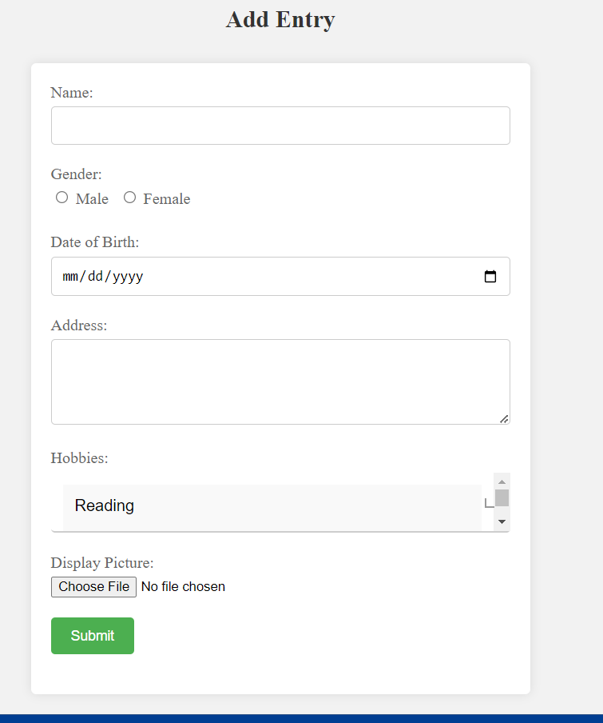
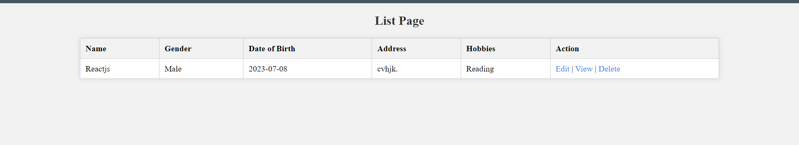
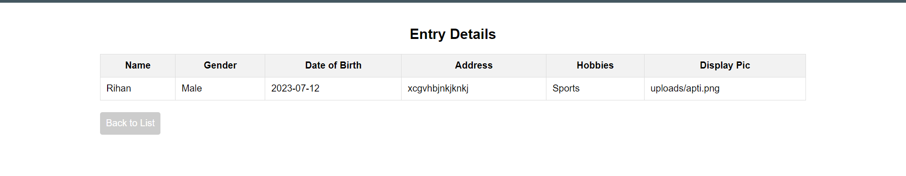

# CRUD Application

This is a simple CRUD (Create, Read, Update, Delete) application built using PHP and MySQL. It allows users to manage entries with the following information:

- Name
- Gender
- Date of Birth
- Address
- Hobbies
- Display Picture

## Features

- Add new entry: Users can fill out a form to add a new entry to the database.
- View list of entries: Users can see a table displaying all the entries from the database.
- Edit entry: Users can edit the details of an existing entry.
- Delete entry: Users can delete an entry from the database.

## Technologies Used

- PHP: Server-side scripting language used for the backend logic.
- MySQL: Database management system used for storing entry data.
- HTML/CSS: Markup and styling for the frontend interface.

## Getting Started

1. Install a web server (e.g., Apache) and a PHP development environment (e.g., XAMPP).
2. Clone this repository or download the source code.
3. Import the included `database.sql` file into your MySQL database to create the required table.
4. Update the database connection details in the `config.php` file.
5. Place the project files in the appropriate web server directory (e.g., htdocs for XAMPP).
6. Access the application through the web browser.

## Usage

1. Add Entry:
   - Fill out the form with the required details (name, gender, dob, address, hobbies, display pic).
   - Click the "Add Entry" button to submit the form and add the entry to the database.

2. View List:
   - Visit the "List" page to see a table displaying all the entries in the database.
   - The table includes columns for name, gender, dob, address, hobbies, and actions (edit, view, delete).

3. Edit Entry:
   - Click the "Edit" action button next to an entry in the list.
   - The edit form will be pre-filled with the existing details of the entry.
   - Update the desired fields and click the "Update Entry" button to save the changes.

4. Delete Entry:
   - Click the "Delete" action button next to an entry in the list.
   - A confirmation box will appear to confirm the deletion.
   - Click "OK" to proceed with the deletion or "Cancel" to cancel the operation.

## License

This project is licensed under the [MIT License](LICENSE).

# Output

